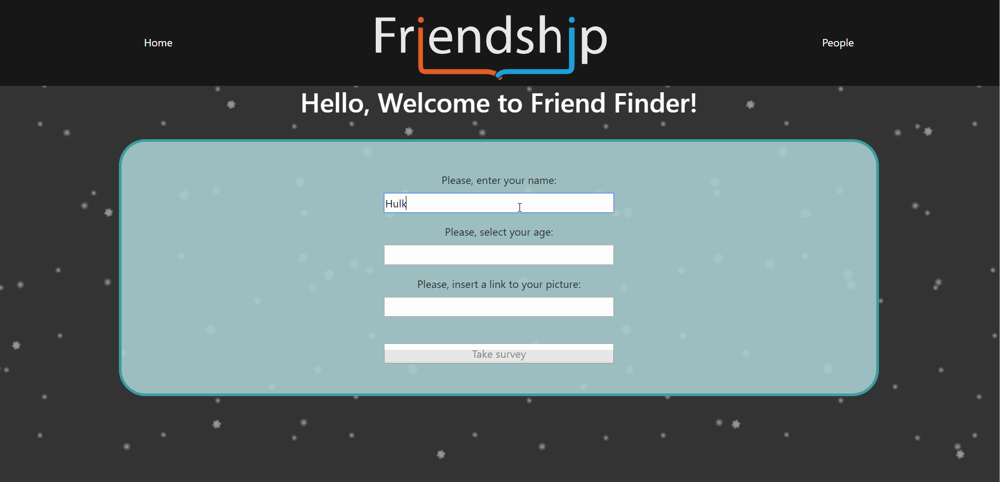

# FriendFinder
_A compatibility-based "FriendFinder" application - basically a dating app. This full-stack site takes in results from users' surveys, then compares their answers with those from other users. Then this app displays the name and picture of the user with the best overall match._

## About
* Each user submits their name, age and picture
* After that, each user is offered 10 statements and each statement has a slider-scale next to it
* By dragging that slider users determine from 1 to 10 how much they agree with current statement (0 - 'totally disagree' vs 10 - 'fully agree')
* Once survey results are submitted, they're passed into an algorithm, that compares new users' results to already existing ones in the database 
* Next page displays the best matching person who answered survey questions with the closest to users' results 

### Data
**SQL Database** has 3 tables:
* Survey questions
* Users' information
* Users' answers

## Typical workflow:
* Inserting our information:

* Answering the questions: 

* Finding a match and scrolling through all-users page:

_This web application was created using following technologies:_
* **HTML**
* **CSS**
* **Bootstrap**
* **JavaScript**
* **JQuery**
* **API POST/GET methods**
* **MySQL**
* **Node.js**
* **Following NPM packages:**
    * "body-parser"
    * "express"
    * "express-handlebars"
    * "mysql"
    * "node-localstorage"
    * "path"
* _Deployed to Heroku using ClearDB_

